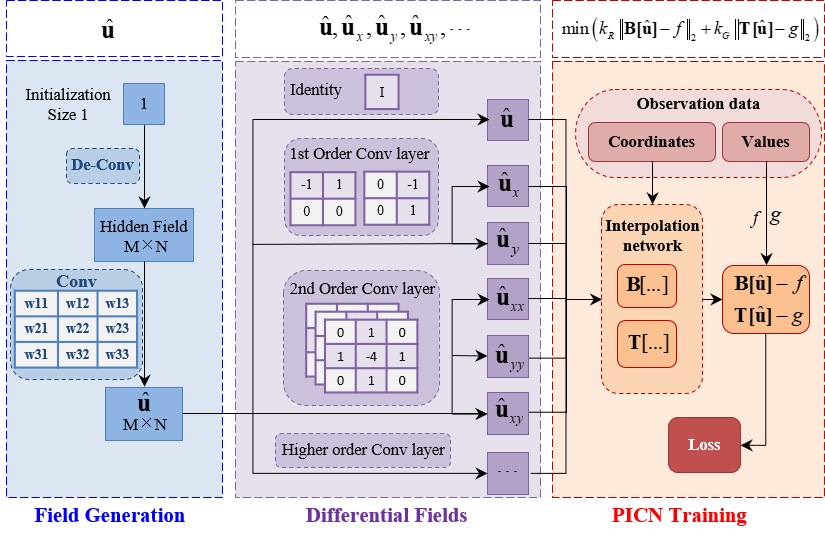
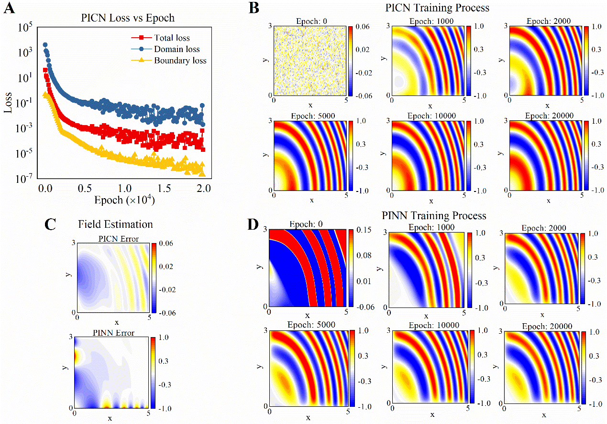
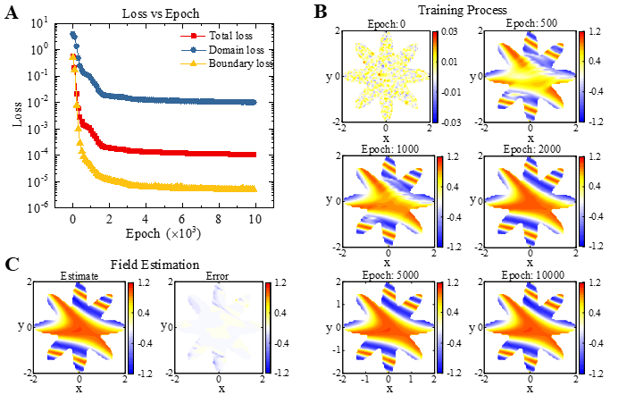

# Physics-informed ConvNet: Learning Physical Field from a Shallow Neural Network

This repository hosts the source code for the paper "Physics-informed ConvNet: Learning Physical Field from a Shallow Neural Network", aiming at the development of a novel Artificial Intelligence (AI)-based Physics-Informed Convolutional Network (PICN) for efficient physical modeling and computation with limited data. The novel AI framework enriches machine learning with physical science for accurate predictions even with a few noisy measurements from an experiment.

## Table of Contents
- [Introduction](#introduction)
- [Contact](#contact)
- [Citation](#citation)

## Introduction
We present a new approach for solving nonlinear partial differential equations (PDE) on regular or irregular domains based on physics-informed ConvNet, which we call the PICN. 
The network structure consists of three parts: 
1) a convolutional neural network for physical field generation.
2) a pre-trained convolutional layer corresponding to the finite-difference filters to estimate differential fields of the generated physical field. 
3) an interpolation network for loss analysis in irregular geometry domains. 
From a CNN perspective, the physical field is generated by a deconvolution layer and a convolution layer. Unlike the standard Physics-informed Neural Network (PINN) approach, the convolutions corresponding to the finite-difference filters estimate the spatial gradients forming the physical operator and then construct the PDE residual in a PINN-like loss function. The total loss function involving boundary conditions and the physical constraints in irregular geometry domains can be calculated from an efficient linear interpolation network. The theoretical analysis of PICN convergence is performed on a simplified case for solving a one-dimensional physical field, and several examples of nonlinear PDE of solutions with multifrequency characteristics are executed. The theory and examples confirm the effective learning capability of PICN for the physical field solution with high-frequency components, compared to the standard PINN. 

A series of numerical cases are performed to validate the current PICN, including solving (and estimating) nonlinear physical operator equations and recovering physical information from noisy observations.

 
### Description of each example
First, the ability of PICN to solve nonlinear PDE has been verified by executing three nonlinear problems including ODE with sine nonlinearity, PDE involving nonlinear sine-square operators, and Schrödinger equation. 
Secondly, the proposed PICN has been assessed by solving some nonlinear PDEs on irregular domains such as star-shaped, bird-like, and starfish domains. 

Thirdly, PICN is applied to identify the thermal diffusivity parameters in an anisotropic heat transfer problem from noisy data and a denoising display of the temperature field from strong noisy data with standard deviations ranging from 0.1-0.4.

The numerical results demonstrate the high accuracy approximation and fast convergence performance of PICN. The potential advantage in approximating complex physical fields with multi-frequency components indicates that PICN may become an alternative efficient neural network solver in physics-informed machine learning.

### Results overview

## Contact
For any queries, feel free to reach out to us at:
* P. Shi - shipengpeng@xjtu.edu.cn
* Z. Zeng - zhizeng@mail.xidian.edu.cn
* T. Liang - liangtianshou@gmail.com

## Citation
If you find our work useful in your research, please consider citing our paper:
[Shi, Pengpeng, Zhi Zeng, and Tianshou Liang. "Physics-informed ConvNet: Learning Physical Field from a Shallow Neural Network." arXiv preprint arXiv:2201.10967 (2022).]
